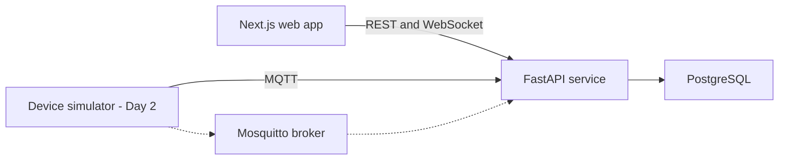

# Visco-Sensor

**A data-driven software platform for an early-stage stroke-prevention device concept.**

Visco-Sensor is an end-to-end IoT health-monitoring project designed to ingest wearable sensor telemetry, validate and transform time-series data, identify abnormal patterns, and deliver real-time insights through patient and clinician experiences.

This repository extends the original Visco-Sensor project through a modern software platform. The original project paired a 3D-printed physical prototype with an application concept for monitoring blood viscosity and communicating trends to patients and healthcare professionals.

> **Development status:** Day 1 establishes the production-minded monorepo, user-interface shell, API health contract, containerized infrastructure, testing, and continuous integration. Device telemetry and clinical workflows will be added incrementally in later milestones.

## Why Visco-Sensor?

Stroke warning signs can be misunderstood or recognized too late. Visco-Sensor began as a med-tech innovation project exploring how longitudinal blood-viscosity monitoring could support earlier awareness and better communication between patients and healthcare professionals.

The project was informed by two separate qualitative interview studies:

- Interviews with 55 older adults and family members focused on accessibility, independence, and peace of mind.
- Interviews with more than 150 patients explored desired monitoring, communication, and preventative-care features.

The original feasibility work projected that proactive monitoring could reduce per-patient healthcare costs from approximately **$25,000 to $4,000**. This figure is a project estimate, not a clinically observed outcome.

## Day 1 architecture



The foundation separates the user interface, application API, device messaging, and persistence layers. This enables each service to be developed and tested independently while remaining reproducible through Docker Compose.

## Technology

| Layer | Tools |
| --- | --- |
| Web | Next.js, React, TypeScript, Tailwind CSS |
| API | Python, FastAPI, Pydantic |
| Streaming | MQTT, WebSockets |
| Data | PostgreSQL, SQLAlchemy |
| Quality | Pytest, Vitest, Ruff, ESLint |
| Infrastructure | Docker Compose, GitHub Actions |

## Repository structure

```text
visco-sensor/
├── apps/
│   ├── api/              # FastAPI application and API tests
│   └── web/              # Next.js patient and clinician interface
├── docs/                 # Architecture, product, safety, and roadmap docs
├── infra/mosquitto/      # Local MQTT broker configuration
├── services/
│   └── device-simulator/ # Added during the next milestone
├── .github/workflows/    # Automated quality checks
├── docker-compose.yml
└── Makefile
```

## Run locally

### Docker (recommended)

1. Copy the environment template:

   ```bash
   cp .env.example .env
   ```

2. Start the services:

   ```bash
   docker compose up --build
   ```

3. Open:

   - Web application: `http://localhost:3000`
   - API documentation: `http://localhost:8000/docs`
   - API health check: `http://localhost:8000/health`

### Without Docker

```bash
make setup
make api   # terminal 1
make web   # terminal 2
```

## Quality checks

```bash
make lint
make test
make build
```

The GitHub Actions workflow repeats these checks on pull requests and pushes to `main`.

## Planned milestones

1. **Foundation:** monorepo, service health checks, local infrastructure, CI.
2. **Telemetry:** reproducible Python device simulator and synthetic sensor events.
3. **Ingestion:** MQTT consumer, validated API contracts, rejected-event handling.
4. **Data platform:** relational models, migrations, transformations, quality metrics.
5. **Patient experience:** live readings, trend charts, alerts, accessible interface.
6. **Clinical workflow:** clinician review, alert acknowledgement, audit trail.
7. **Reliability:** integration tests, observability, expanded CI and documentation.

See [the detailed roadmap](docs/roadmap.md) for suggested commit boundaries.

## Project authorship

Visco-Sensor was developed by **Sahib Sohi and another founder**. Sahib co-founded the project and led its software development. Repository access can be extended to the other founder for collaboration and attribution.

## Medical and safety notice

Visco-Sensor is an educational, early-stage prototype and software demonstration. It is not clinically validated, medically approved, or intended to diagnose, prevent, monitor, or treat any medical condition. All future readings, alerts, risk labels, and intervention events in this repository will use synthetic data and demonstration logic. Do not use this software for patient care or medication decisions.

## License

Copyright (c) 2026 Visco-Sensor contributors. All rights reserved. No open-source license is granted at this stage while intellectual-property considerations are reviewed.
