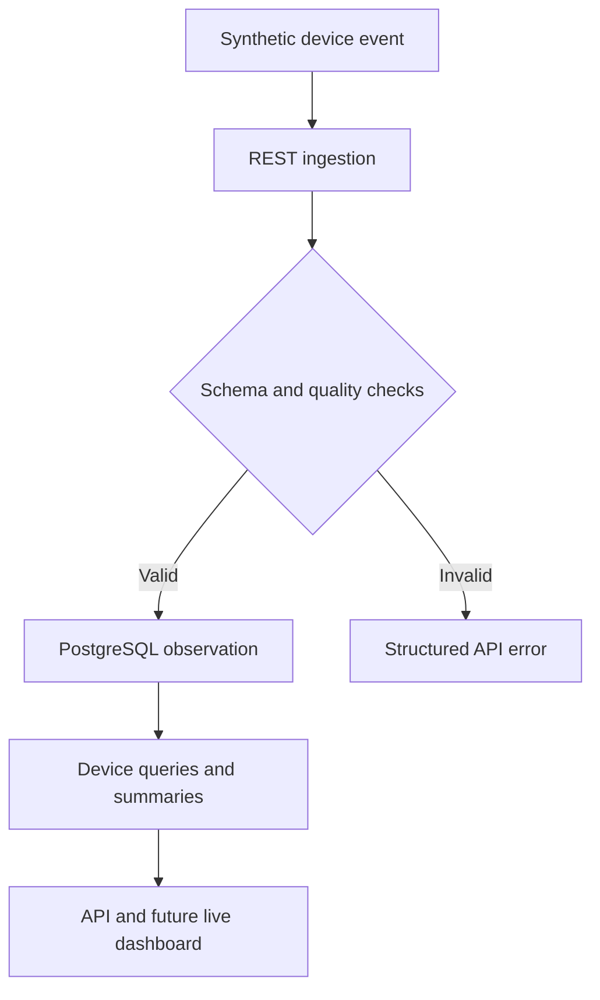

# Architecture

## Design goals

- Keep device ingestion independent from the web interface.
- Preserve raw telemetry before producing derived metrics.
- Validate data at service boundaries.
- Make local development reproducible.
- Keep synthetic and clinical data clearly separated.
- Support incremental additions without introducing unnecessary infrastructure.

## Service boundaries

### Web application

The Next.js application presents patient and clinician experiences. It communicates with the API rather than reading the database or MQTT broker directly.

### API

FastAPI owns application contracts, validation, health checks, ingestion, device summaries, and future real-time WebSocket sessions. SQLAlchemy keeps persistence concerns separate from request contracts.

### MQTT broker

Mosquitto provides the local publish/subscribe transport for a future asynchronous ingestion path. The current simulator uses the versioned REST contract so validation, persistence, and failure handling can be exercised end to end.

### PostgreSQL

PostgreSQL stores validated synthetic readings with indexes on event IDs, device IDs, patient pseudonyms, and device-timestamp pairs. Future migrations will extend the model to raw events, rejected events, alerts, and audit history.

## Planned data lifecycle

## Architectural decisions

- **REST before MQTT:** a synchronous ingestion contract makes validation and failure semantics explicit; MQTT remains the planned transport for asynchronous device communication.
- **PostgreSQL first:** relational modelling and indexed time-series queries are sufficient before introducing specialized analytical storage.
- **WebSocket updates:** the API will push new validated observations without requiring clients to poll continuously.
- **Monorepo:** one repository keeps cross-service contracts, documentation, tests, and local infrastructure synchronized.
