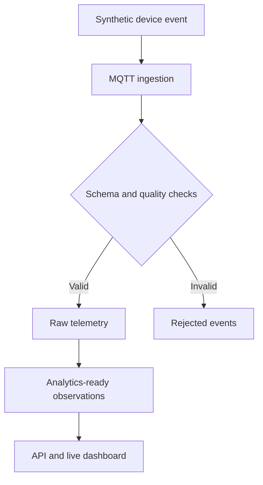

# Architecture

## Design goals

- Keep device ingestion independent from the web interface.
- Preserve raw telemetry before producing derived metrics.
- Validate data at service boundaries.
- Make local development reproducible.
- Keep synthetic and clinical data clearly separated.
- Support incremental additions without introducing unnecessary infrastructure.

## Service boundaries

### Web application

The Next.js application presents patient and clinician experiences. It communicates with the API rather than reading the database or MQTT broker directly.

### API

FastAPI owns application contracts, validation, health checks, and future real-time WebSocket sessions. Business logic will remain in dedicated service modules instead of route handlers.

### MQTT broker

Mosquitto provides the local publish/subscribe transport for future device events. The Day 2 simulator will publish versioned synthetic telemetry messages.

### PostgreSQL

PostgreSQL will store device registrations, raw readings, validated observations, alerts, and audit events. Migrations and persistence models arrive in the data-platform milestone.

## Planned data lifecycle

## Architectural decisions

- **MQTT over Kafka:** MQTT matches constrained device communication and keeps the prototype proportionate to its expected scale.
- **PostgreSQL first:** relational modelling and indexed time-series queries are sufficient before introducing specialized analytical storage.
- **WebSocket updates:** the API will push new validated observations without requiring clients to poll continuously.
- **Monorepo:** one repository keeps cross-service contracts, documentation, tests, and local infrastructure synchronized.
